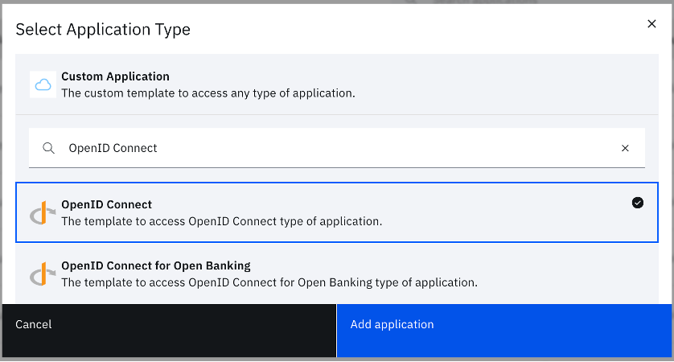
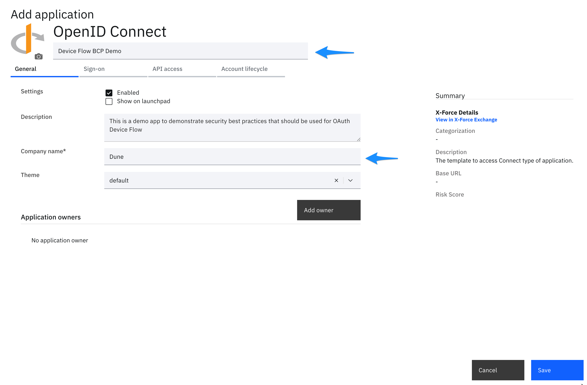
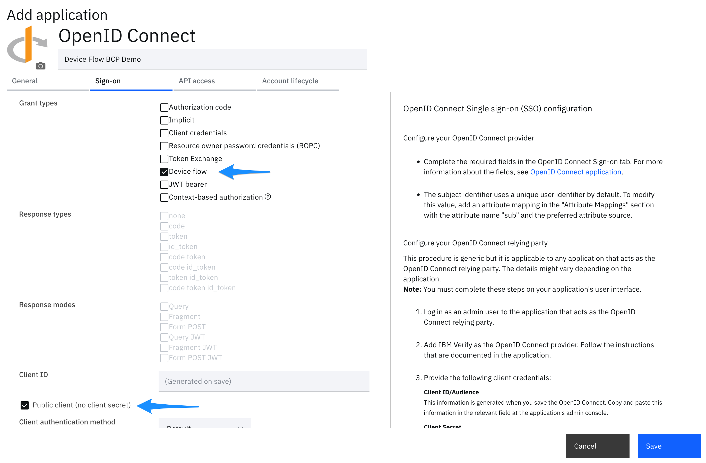
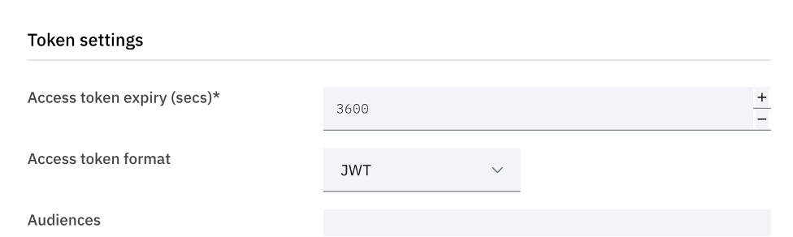
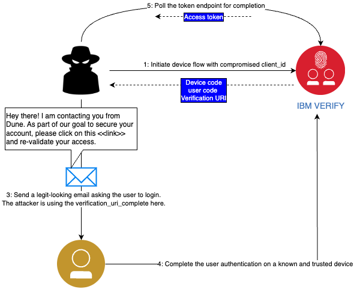
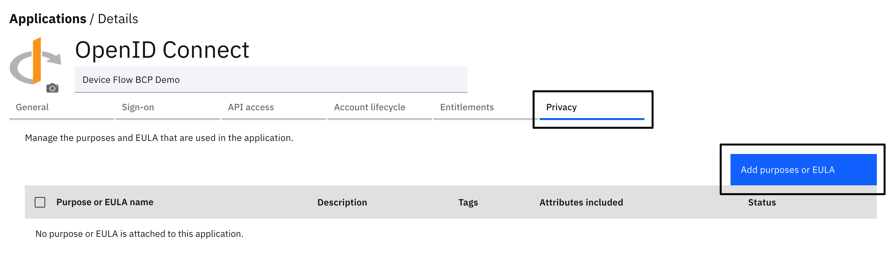
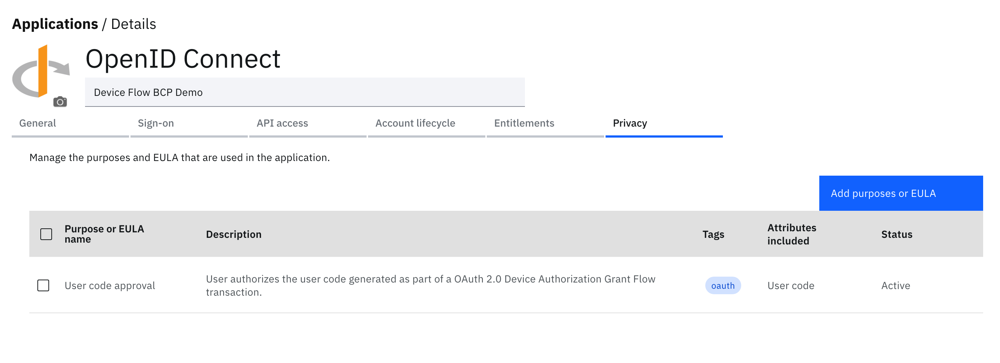

**TL;DR:** In June 2021, SecureWorks researchers published [OAuth's Device Code Flow Abused in Phishing Attacks](https://www.secureworks.com/blog/oauths-device-code-flow-abused-in-phishing-attacks). In 2022, the first draft of [Cross-Device Flows: Security Best Current Practice](https://datatracker.ietf.org/doc/draft-ietf-oauth-cross-device-security/) was published and has been continuously updated since. This BCP provides several recommendations to secure cross-device OAuth flows, like Device Flow and Client Initiated Backchannel Authentication. We'll discuss how you would implement important mitigations using IBM Verify.

# OAuth 2.0 Best Practices for Device Flow with IBM Verify

The OAuth 2.0 Device Authorization Grant Flow (or simply Device Flow) enables applications running on devices with no browser or limited input capability to obtain an access token. This token that can then be used to access protected resources on behalf of a user. This is commonly seen in applications running on Apple TV, Android TV, Amazon Echo and others, where a user is shown a QR code or link including an optional one-time registration code. The user logs in using a companion device, like a smart phone or laptop. The device that requests for the token is called a _consumption device_ and the one used by the user to authenticate and authorize the request is called an _authorization device_.

Depending on how the OAuth 2.0 client is configured, it can be prone to phishing attacks, as described in this article titled [OAuth’s Device Code Flow Abused in Phishing Attacks](https://www.secureworks.com/blog/oauths-device-code-flow-abused-in-phishing-attacks). We'll apply some of the principles described in [Cross-Device Flows: Security Best Current Practice](https://www.ietf.org/archive/id/draft-ietf-oauth-cross-device-security-12.html) to configure an application using Device Flow on IBM Verify.

## Getting Started

### Accessing the IBM Verify SaaS environment

1. You will need a Verify SaaS tenant. You can get a [free trial](https://docs.verify.ibm.com/verify/docs/getting-started-signing-up-for-a-free-trial).

2. Login to the admin console: https://your-tenant.verify.ibm.com/ui/admin

### Configuring the application to run a basic flow

1. On the left-hand side menu, select "Applications" and click on "Applications".

2. Click "Add an application" to open the application catalog. In the search bar, type "OpenID Connect" and choose the "OpenID Connect" application type.

    

3. Click on "Add application".

4. The next screen is the application definition wizard. The starting tab shows general settings where you can configure basic details. Give the application an appropriate name and fill in the mandatory fields, such as the "Company name".

    

5. Select the "Sign-on" tab and configure the following:
   1. Grant types - Select "Device flow". Uncheck all the other grant types.
   2. (Optional) Public client - Enable this if the application cannot be a confidential client. This would apply to cases where the OAuth credentials have to be packaged with the application that is distributed, say, through a marketplace or application store.

   

6. Under Token Settings, navigate to the "Access token format" and select "JWT". This is primarily for convenience to examine the contents of the token when it is issued.

    

7. Click on "Save" to save the application. You will be redirected to the "Entitlements" tab. Select "Automatic access for all users and groups" and save the configuration.

8. Navigate back to the "Sign-on" tab and copy the client ID. You will need to configure this on your application.

### Run the basic flow

Device Flow begins with a call to `/oauth2/device_authorization` from the consumption device.

```bash
curl 'https://your-tenant.verify.ibm.com/oauth2/device_authorization' \
--header 'Content-Type: application/x-www-form-urlencoded' \
--data-urlencode 'client_id=<client_id>'
```

The response is as below:

```json
{
    "device_code": "tKcKfPUA_hF1CIqS-uL1TxlHHg84qpVt1ssIWw7q6-E.eHPgVHStl7sG-GGN9M8GD8omTz38vavHT19idT5uKspT1O0K0k00bsyxIhNow4Y_2Ij1SEPTzyDV7t_v8BG9NQ",
    "expires_in": 299,
    "interval": 5,
    "user_code": "70HYPR",
    "verification_uri": "https://your-tenant.verify.ibm.com/oauth2/user_authorization",
    "verification_uri_complete": "https://your-tenant.verify.ibm.com/oauth2/user_authorization?user_code=38ORIH"
}
```

Typically, the device keeps track of the `device_code` and displays the `user_code` and either the `verification_uri` or the `verification_uri_complete`. Note in the diagram below that the `verification_uri` has been shortened using a custom URL shortener. The `verification_uri_complete` might also be shown as a QR code if the intent is for the user to scan it with a mobile phone and use their phone's browser to complete the next step.


When the user scans the QR code or browses to the link on a browser, the user is asked to enter the `user_code` value. It may be prefilled or the prompt skipped entirely when the QR encodes `verification_uri_complete` where the `user_code` is included as a query string parameter.


Once the user enters the user code, the user is taken through a login process and authorizes the request to proceed. Authentication can include the use of phishing resistant methods like passkeys and include adaptive MFA policies. Note that while user authentication on their browser can (and is recommended to) be phishing resistant, this does not make the entire device code flow phishing resistant as there is no guarantee that the `user_code` isn't that of a bad actor.


While the user is busy completing this process on their _authorization device_, the _consumption device_ will poll for completion by invoking the token endpoint:

```bash
curl 'https://your-tenant.verify.ibm.com/oauth2/token' \
--header 'Content-Type: application/x-www-form-urlencoded' \
--data-urlencode 'client_id=device_client_id' \
--data-urlencode 'grant_type=urn:ietf:params:oauth:grant-type:device_code' \
--data-urlencode 'device_code=tKcKfPUA_hF1CIqS-uL1TxlHHg84qpVt1ssIWw7q6-E.eHPgVHStl7sG-GGN9M8GD8omTz38vavHT19idT5uKspT1O0K0k00bsyxIhNow4Y_2Ij1SEPTzyDV7t_v8BG9NQ'
```

> 📘 Note
> 
> While the call above shows the use of a public client, IBM Verify offers multiple client authentication methods, including the use of client secrets, JWTs, X.509 client certificates etc. The public client is used here to demonstrate and describe best practices related to the phishing attack described later in this article. In many cases, a public client may be the only practical option if the app is not able to secure secrets.

When the user completes the sign in process, the token call returns a valid access token that can then be used to call protected APIs from the _consumption device_.

### Challenges with the basic flow

We will assume here that the attacker is aware of the client ID. Thus, the attacker can make the API call to the `device_authorization` endpoint to obtain a valid set of device and user codes, and the `verification_uri_complete`. The attacker now uses standard phishing techniques - a legitimate looking email, for example - to convince the victim to visit the attacker's `verification_uri_complete` URI and complete authorization. When the victim does this, the next poll to the token endpoint by the attacker results in access/refresh tokens that can be used to access protected resources on behalf of the victim.



Notice here that the user may use the strongest form of authentication on their _authorization device_ and is still prone to this form of an attack.

## Applying Best Practices

There are several strategies that may be employed to help mitigate this form of an attack. Many of these are discussed in detail in [Cross-Device Flows: Security Best Current Practice](https://datatracker.ietf.org/doc/draft-ietf-oauth-cross-device-security/) (draft 12 at time of writing). IBM Verify offers a number of BCP mitigations, including one-time-use user codes and sender-constrained tokens.

We'll zoom into specific mitigations here that are unique to Device Flow:

1. Configure the lifetime of the device code to a short period of time. This is practical when the user is actively interacting with the system and is expected to complete the authentication flow within, say, 5 minutes.

2. Provide enough context to the user during authentication, such as where they should see this form of a request and what they should do. For example, if the app presents a QR code and link on a specific page on the device, the user should not expect to receive an email to initiate the login process.

### Device code lifetime

In this section we are going to highlight how IBM Verify may be configured to implement best practices for user code lifetime (secton 6.1.2 of draft 12). By default, this is set to 5 minutes in IBM Verify. You can choose the appropriate value based on the expected user behaviour. For example, if the user is expected to scan the QR code using a known phone, the process of authentication will likely be under 5 minutes.

Follow the steps below in the IBM Verify admin console:

1. On the left-hand side menu, select "Applications" and click on "Application settings".

2. Click on "OIDC general settings".

3. Set the "Device flow code lifetime" to the appropriate value in seconds.

    

### Provide context and obtain approval

In this section we are going to highlight how IBM Verify may be configured to implement best practices for User Experience (secton 6.1.14 of draft 12), in particular for displaying context to the user during authorization consent. Note also that the [Device Flow standard](https://www.rfc-editor.org/rfc/rfc8628.html#section-5.4) recommends the following.


You can accomplish this in IBM Verify by displaying a consent page that shows the user code and provides information, such as the following. The message shown to the user can be customized to be more specific. For example: Compare the code to the one shown on BCP Demo App on your Android TV. `70HYPR` in the image below is the user code.


In order to achieve this experience, follow the steps as below.


#### Configure the Attribute representing the user code

1. Go to Directory > Attributes on the IBM Verify Admin Console.

    

2. Begin the process of adding a fixed value attribute. This will act as a placeholder representing the user code.

    

3. Name the attribute "User Code" with a specific identifier called "user_code". The ID is important because this is used later.

    

4. Set a default value. This value is never used.

    

5. Attribute has been added.

    

#### Configure the Data Privacy purpose representing the user approval

1. Go to Data privacy and consent > Data purposes

    

2. Begin the process to create the purpose. The purpose ID must be set to `user_code_approval`. This value is used later.

    

3. Choose the default access type.

    

4. Add the user code attribute to the purpose.

    

5. Publish the data purpose.

    

6. The purpose has been created.

    

#### Update the application configured to use Device Flow

1. Navigate to the application and edit. Go to the "Sign on" tab.

2. Scroll down to the Endpoint Configuration section and edit the Authorize endpoint settings. This will pop a modal dialog up.

    

3. Edit the Consent Request.

    

4. Copy the expression below and paste it in the code editor. This uses the CELx language that IBM Verify uses for scripting safely.

    ```yaml
    statements:
    # If the user code is present in the request, add it to the consent request items.
    - context: >
        user_code_scope := requestContext.getValue("user_code") != "" ? [{
            "purpose": "user_code_approval",
            "attribute": "user_code",
            "value": requestContext.getValue("user_code")
        }] : []
    # Auto-authorize all requested OAuth scopes.
    # If you don't want the client requesting
    # any OAuth scopes, just drop this entire statement and return
    # the context.user_code_scope.
    - context: >
        auto_grant_scopes := has(requestContext.scope) ? requestContext.scope.map(x, {
            "purpose": "ibm-oauth-scope",
            "attribute": x,
            "scope": x,
            "autoGrant": true
        }) : []
    - return: >
        context.user_code_scope + context.auto_grant_scopes
    ```

    The editor will look as below. Click OK.

    

5. Scroll down in the "Sign on" tab and ensure the consent action is configured to ask for consent.

    

6. Save the application.

7. Go to the "Privacy" tab and add a purpose.

    

8. Add the "User code approval" purpose to the list of allowed purposes for this application.

    

9. Save the application.

    

#### Update the consent page template

The consent page is a customizable HTML template in a theme.

1. Go to "User experience" > "Branding".

    

2. Choose the appropriate theme that is associated with your application.

    

3. Navigate to the OIDC user consent page and edit. This is illustrated in the picture.

    

4. Above the "consent_form_verifier" hidden field and the submit button, add the following snippet. You may re-style this as needed. This segment shows the code to the user and provides any appropriate instructions.

    ```html
    [RPT purpose_user_code_authorization]
    <div class="bx--form-item">
        <p>Verify that the code you see here matches the one on the app.</p>
        <div style="font-size:14pt">
        @PRIVACY_SCOPE_ATTRVALUE_REPEAT@
        </div>
    </div>
    [ERPT purpose_user_code_authorization]
    ```

    

5. Click Save.

### Run the flow

You can now repeat the device flow and you will notice the additional consent page that shows the user the code and instructions to compare it to the one displayed on the application. Adjust the wording as appropriate.

## The wrap

In this article, we explored the OAuth 2.0 Device Authorization Grant Flow and some of the security implications, in particular when using public OAuth 2.0 clients. We discussed how IBM Verify can be configured to apply mitigations to protect against attackers by applying some of the recommendations in [Cross-Device Flows: Security Best Current Practice](https://datatracker.ietf.org/doc/draft-ietf-oauth-cross-device-security/).

**Key takeaways**

1. **Device Flow Vulnerability:** While Device Flow enables users to access applications on input-constrained devices, it is vulnerable to phishing attacks where attackers trick victims into authorizing requests that are not legitimate.

2. **Defense in Depth:** It is crucial to implement multiple layers of security -
   1. Standard OAuth 2.0 best practices like sender-constrained tokens and enforcing least privilege when issuing tokens to contain the attack surface.
   2. Short-lived user codes.
   3. Provide a User Experience that displays enough context to the user to verify the legitimacy of the request.

3. **Configuration in IBM Verify:** Learn how to implement the mitigations in the IBM Verify application configuration.
